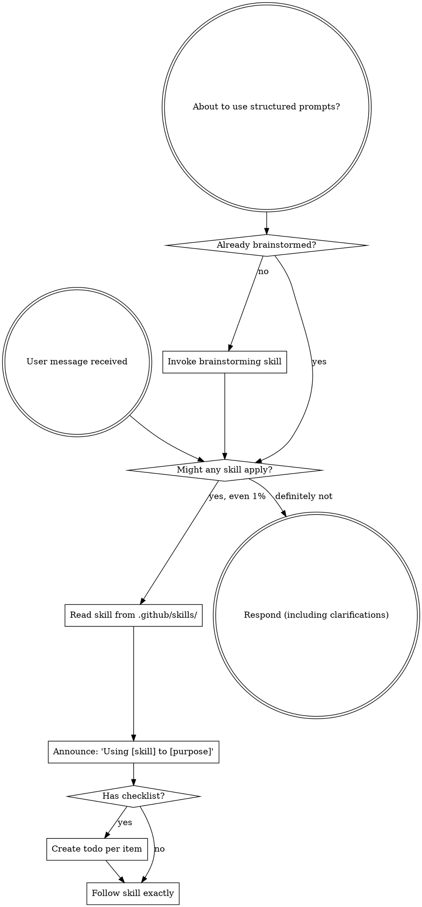

<EXTREMELY-IMPORTANT>
If you think there is even a 1% chance a skill might apply to what you are doing, you ABSOLUTELY MUST invoke the skill.

IF A SKILL APPLIES TO YOUR TASK, YOU DO NOT HAVE A CHOICE. YOU MUST USE IT.

This is not negotiable. This is not optional. You cannot rationalize your way out of this.
</EXTREMELY-IMPORTANT>

## How to Access Skills

Skills are discovered via SKILL.md `description` field and loaded by reading files from `.github/skills/`. When a skill is activated, its full content is loaded into context — follow its instructions directly.

### Skill Locations

| Location | Scope |
|----------|-------|
| `.github/skills/<skill-name>/SKILL.md` | Project/repository-level |
| `~/.github/skills/<skill-name>/SKILL.md` | Personal (user-wide) |

### Creating New or Updating Skills

Use the `skill-creator` skill to scaffold new Agent Skills with proper structure, frontmatter, and optional bundled resources.

# Using Skills

## The Rule

**Invoke relevant or requested skills BEFORE any response or action.** Even a 1% chance a skill might apply means that you should invoke the skill to check. If an invoked skill turns out to be wrong for the situation, you don't need to use it.

## Red Flags

These thoughts mean STOP — you are rationalizing:

| Thought | Reality |
|---------|---------|
| "This is just a simple question" | Questions are tasks. Check for skills. |
| "I need more context first" | Skill check comes BEFORE clarifying questions. |
| "Let me explore the codebase first" | Skills tell you HOW to explore. Check first. |
| "I can check git/files quickly" | Files lack conversation context. Check for skills. |
| "Let me gather information first" | Skills tell you HOW to gather information. |
| "This doesn't need a formal skill" | If a skill exists, use it. |
| "I remember this skill" | Skills evolve. Read current version. |
| "This doesn't count as a task" | Action = task. Check for skills. |
| "The skill is overkill" | Simple things become complex. Use it. |
| "I'll just do this one thing first" | Check BEFORE doing anything. |
| "This feels productive" | Undisciplined action wastes time. Skills prevent this. |
| "I know what that means" | Knowing the concept ≠ using the skill. Invoke it. |

## Skill Priority

### If the user says

"Let's build X" or "Let's plan Y" or "Let's implement Z" → prioritize brainstorming skills first, then planning skills.

1. **Process skills first** (brainstorming) — these determine HOW to approach the task
2. **Planning skills second** (structured-autonomy-plan) — these determine HOW to planning the task
3. **STOP** - Agent must stop here and wait for the user to read the plan.

### Else if the user says

"Fix this bug" → debugging skills first, then domain-specific skills.

### Otherwise

If a matching skill exists, use it. If not, respond directly.

## Skill Types

**Rigid** (TDD, debugging): Follow exactly. Don't adapt away discipline.

**Flexible** (patterns): Adapt principles to context.

The skill itself tells you which.

## User Instructions

Instructions say WHAT, not HOW. "Add X" or "Fix Y" doesn't mean skip workflows.
